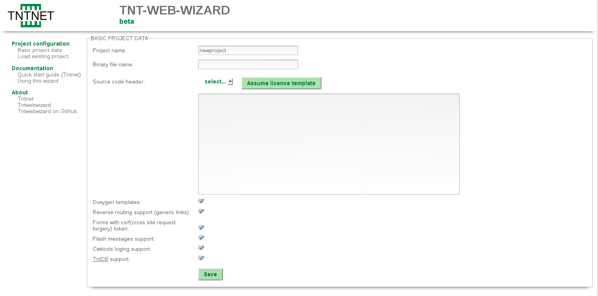

# Tntwebwizard

A witzard for tntnet with web gui.

# Project page

[https://github.com/OlafRadicke/tntwebwizard](https://github.com/OlafRadicke/tntwebwizard)

# License

GNU affero general public license version 3

# Requirement

## Build system

As build system is used tntmake. You find this tool on
[GitHub](https://github.com/OlafRadicke/tntmake)

## Libraries

A tntnnet environment with cxxtools and tntnet

* [https://github.com/maekitalo/tntnet](https://github.com/maekitalo/tntnet)
* [https://github.com/maekitalo/cxxtools](https://github.com/maekitalo/cxxtools)

## runtime requirement
* zip
* curl
* git

# Build

Go to main directory with the Makefile.tnt and to the command

>  tntmake -b

After there you find die binary file in a directory "build".

# Files and directories

> tntwebwizard.pro

Contains project data of tntwebwizard tool.

> /tmp/tntwebwizard/

In this directory will storage tntwebwizard his temporary files and directories.

# Documentation

Do command "doxygen ./Doxyfile" for generation (api) documentation.

